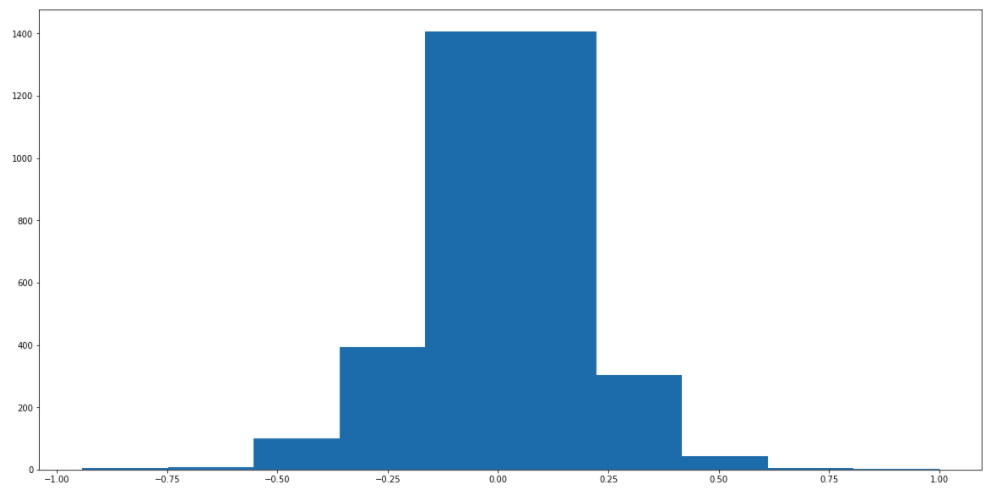

### Files Submitted & Code Quality

#### 1. Submission includes all required files and can be used to run the simulator in autonomous mode

My project includes the following files:
* model.py containing the script to create and train the model
* drive.py for driving the car in autonomous mode
* model.h5 containing a trained convolution neural network 
* writeup_report.md or writeup_report.pdf summarizing the results

#### 2. Submission includes functional code
Using the Udacity provided simulator and my drive.py file, the car can be driven autonomously around the track by executing 
```sh
python drive.py model.h5
```

#### 3. Submission code is usable and readable

The model.py file contains the code for training and saving the convolution neural network. The file shows the pipeline I used for training and validating the model, and it contains comments to explain how the code works.

### Model Architecture and Training Strategy

#### 1. An appropriate model architecture has been employed

After many attempts of my own model design I finally decided use NVIDIA's model architecture.  Which is found here: https://images.nvidia.com/content/tegra/automotive/images/2016/solutions/pdf/end-to-end-dl-using-px.pdf.  After many car simulation runs this worked the best and with less data as well.

My model can be found in model.py.  I applied the ReLU activation function after each layer to introduce non-linearity.  The data is first Normalized with a Keras Lambda layer. 

#### 2. Attempts to reduce overfitting in the model

The model contains Max Pooling layers to help the model not memorize or over-fit the data.  Max Pooling also helps with the computational costs.


#### 3. Model parameter tuning

The model uses an adam optimizer, so I did not choose a learning rate manually. My model only used 5 epochs.

#### 4. Appropriate training data

The final data I ended up using was only Udacity's.  From that I used a combination of the center, left and right images.

### Model Architecture and Training Strategy


#### 1. Solution Design Approach

The overall strategy for deriving a model architecture was to create layers of CNN's followed by Fully Connected layers using a variation of Udacity's and my own collected data from the simulator.

Initially I tried a various amounts of different model architectures.  Ranging from 3 to 5 layers of CNN's and Dense layers.  The CNN filters ranged from 24 to 256 and the Dense layers from 1164 to 1. All with my own data and Udacity's.  Some worked okay and other models drove the car sporadically and eventually crashing.

To combat the pooring driving I collected more corrective driving data, added 1 or more CNN layers. Introduced Max Pooling or Dropout.  I would continually check my model variations with Keras Checkpoint function after each epoch to see how driving was going.

Eventually, I found using NVIDIA's model worked really well for me. Although, at 30mph the car seems to of over-fit.  15mph and 20mph the car successfully completes laps on Track 1.  I also, only used Udacity's data for NVIDIA's model and it seemed to work.  I only used about 3,675 sample data and this could be the reason for over-fitting noticed at 30mph in the simulator.

#### 2. Final Model Architecture

Here is the final model visualization taken from the NVIDIA paper:


Here's the code used:

```sh
from keras.models import Sequential
from keras.layers import Flatten, Dense, Activation, Lambda, Cropping2D, Dropout, MaxPooling2D
from keras.layers import Conv2D
from keras.callbacks import ModelCheckpoint

model = Sequential()

model.add(Lambda(lambda x: (x / 255.0) - 0.5, input_shape=(160, 320, 3)))

model.add(Cropping2D(cropping=((70,25), (0, 0))))

model.add(Conv2D(24, (5, 5), strides=(2,2), padding='same'))
model.add(Activation('relu'))
model.add(MaxPooling2D(pool_size=(2, 2), strides=(1, 1)))

model.add(Conv2D(36, (5, 5), strides=(2,2), padding='same'))
model.add(Activation('relu'))
model.add(MaxPooling2D(pool_size=(2, 2), strides=(1, 1)))

model.add(Conv2D(48, (5, 5), strides=(2,2), padding='same'))
model.add(Activation('relu'))
model.add(MaxPooling2D(pool_size=(2, 2), strides=(1, 1)))

model.add(Conv2D(64, (3, 3), strides=(2,2), padding='same'))
model.add(Activation('relu'))
model.add(MaxPooling2D(pool_size=(2, 2), strides=(1, 1)))

model.add(Conv2D(64, (3, 3), strides=(1,1), padding='same'))
model.add(Activation('relu'))
model.add(MaxPooling2D(pool_size=(2, 2), strides=(1, 1)))

model.add(Flatten())

model.add(Dense(1164))
model.add(Activation('relu'))
model.add(Dense(100))
model.add(Activation('relu'))
model.add(Dense(50))
model.add(Activation('relu'))
model.add(Dense(10))
model.add(Activation('relu'))
model.add(Dense(1))

model.compile(loss='mse', optimizer='adam')

checkpoint = ModelCheckpoint('model-mid.h5', monitor='val_loss', verbose=0, save_best_only=False, 
                              save_weights_only=False, mode='auto', period=1)

model.fit_generator(train_generator, 
                    steps_per_epoch=len(train_samples)*AUGMENTED_PICS_ADDED_TO_SAMPLE//BATCH_SIZE, 
                    validation_data=validation_generator,
                    validation_steps=len(validation_samples)*AUGMENTED_PICS_ADDED_TO_SAMPLE//BATCH_SIZE, 
                    epochs=5, verbose=1, shuffle=True, callbacks=[checkpoint])

model.save('model.h5')
```

#### 3. Creation of the Training Set & Training Process

Here is a sample from the driving data.  This is center lane driving with all 3 camera angles.

Center Camera | Left Camera | Right Camera
- | - | -
 |  | 

During training I would choose randomly one of these images.  If the center camera image was choosen I used the steering angle as is.  However, for the the left and right camera images I used a steering correction constant number. Initially I had 0.25 but eventually ended up using 0.18 and that seemed to work fairly good.

To further augment the data once an image was choosen I would also flip that image and inverse the steering angle value.  So, both the flipped and original image would be used while training.  I also used Kera's cropping method to crop out details of the hood of the car and the landscape. I was trying to grab only the details of the road.

I used a total of 3,675 samples from Udacity's data.  But because I added the a flipped image to training the amount of samples doubled (7,350).

I also removed a lot of samples containing 0 steering angles.  Here's a picture of the final distribution of steering angles used:




20% of this data was used for validation.  During training I used a Keras generator that would shuffle the samples for both the training data and validation data.

I used the training data to train the model and the validation data helped with determining how the model was doing.  Keras ModelCheckpoint also helped as I would use the model saved after each epoch and test drive that model as well.

Here's a sample output from Keras during training for 5 epochs:


I used an adam optimizer so that manually training the learning rate was not necessary.
